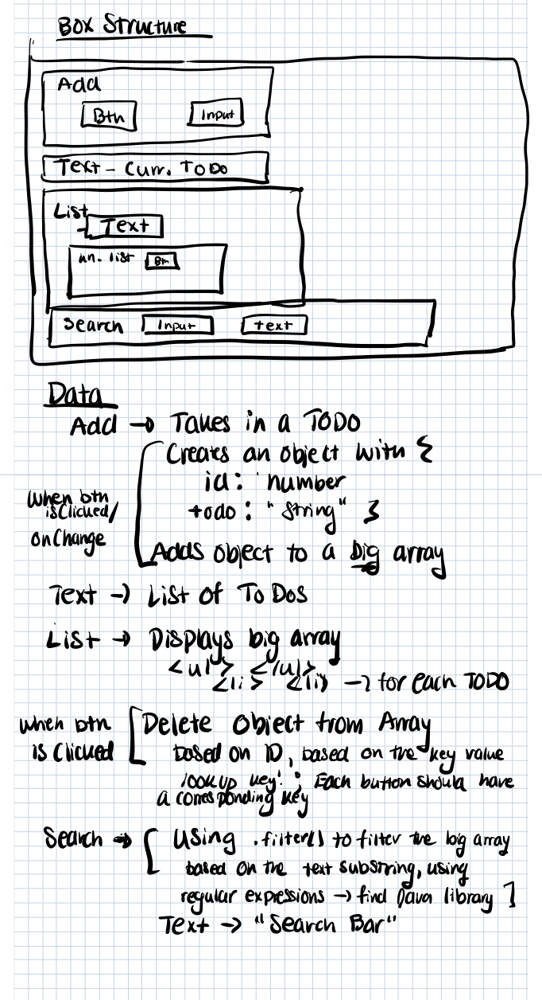

# Phase One  

# Component Structure Description

We have three main components for our application. 

The first is Add. Add can be broken down into two smaller components; the input and hte button. Input will be a form that takes in user input. This input will be text - the TODO. The button will be the "Add" button. Once the user has completed writing the TODO,pressing the Add button will officially add the text to the list of TODOs. The Add compoment will create an object for each TODO. This object includes a string for the TODO and a id number to identify the TODO. Add will then add the object to an array which will hold all TODO objects.

The second component is List. Above the List is text which states "Current List of TODOs", so the user understands what the below list includes. This list is an unordered list -  it will simply have bullet points for each TODO. The List component will get data from the Add component, specifically from the object array. It will list each text string TODO from the array. Each TODO will also have a delete button. This delete button is part of another component within List. When clicked, the delete button will remove the TODO from the TODO object array; it will no longer be displayed in List. It can remove the TODO object by using the TODO id to find it within the array and delete it. 

The final component is Search. The search will have user input and text. The user input will be a substring. We can use JS regular expressions to filter the Add object array to display certain TODOs depending on the searched substring. Search will also have a text component that describes that it is a search field. 